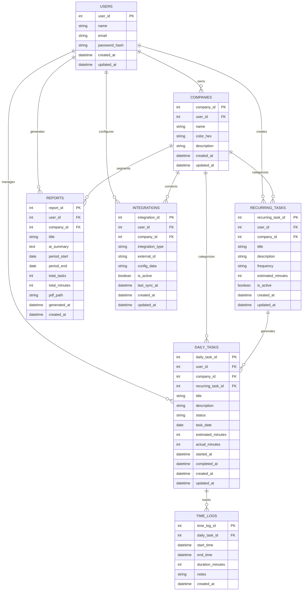

# Especificações do Projeto

### Definição do Problema

Desenvolvedores que gerenciam múltiplos projetos enfrentam dificuldades para organizar tarefas diárias, manter visibilidade do que deve ser executado, gerar relatórios profissionais para clientes e gerenciar eficientemente tarefas recorrentes versus pontuais. A falta de uma ferramenta unificada resulta em perda de produtividade, dificuldade na prestação de contas e gestão fragmentada entre diferentes clientes.

### Solução Proposta

Sistema web híbrido kanban/diário com IA integrada que oferece organização temporal de tarefas, geração automática de relatórios profissionais e gestão inteligente de recorrências. A solução centraliza a gestão diária em uma interface visual intuitiva, automatiza processos repetitivos e fornece insights de produtividade.

---

## Usuário do Sistema

| **Tipo de Usuário** | **Descrição** | **Responsabilidades** |
|---------------------|---------------|----------------------|
| **Desenvolvedor Freelancer** | Profissional autônomo que atende múltiplos clientes simultaneamente | Organizar tarefas diárias por cliente, controlar tempo trabalhado, gerar relatórios para prestação de contas, configurar tarefas recorrentes, acompanhar métricas de produtividade |

---


## Arquitetura e Tecnologias

Descreva brevemente a arquitetura definida para o projeto e as tecnologias a serem utilizadas. Sugere-se a criação de um diagrama de componentes da solução.

## Project Model Canvas

Deve ser desenvolvido a partir do microfundamento: Empreendedorismo e inovação.
Colocar a imagem do modelo construído apresentando a proposta de solução.

> **Links Úteis**:
> Disponíveis em material de apoio do projeto

## Requisitos

As tabelas que se seguem apresentam os requisitos funcionais e não funcionais que detalham o escopo do projeto. Para determinar a prioridade de requisitos, aplicar uma técnica de priorização de requisitos e detalhar como a técnica foi aplicada.

Para mais informações, consulte os microfundamentos Fundamentos de Engenharia de Software e Engenharia de Requisitos de Software. 

### Requisitos Funcionais

|ID    | Descrição do Requisito  | Prioridade |
|------|-----------------------------------------|----|
|RF-001| Permitir que o usuário cadastre tarefas | ALTA | 
|RF-002| Emitir um relatório de tarefas no mês   | MÉDIA |

### Requisitos não Funcionais

|ID     | Descrição do Requisito  |Prioridade |
|-------|-------------------------|----|
|RNF-001| O sistema deve ser responsivo para rodar em um dispositivos móvel | MÉDIA | 
|RNF-002| Deve processar requisições do usuário em no máximo 3s |  BAIXA | 

Com base nas Histórias de Usuário, enumere os requisitos da sua solução. Classifique esses requisitos em dois grupos:

- [Requisitos Funcionais
 (RF)](https://pt.wikipedia.org/wiki/Requisito_funcional):
 correspondem a uma funcionalidade que deve estar presente na
  plataforma (ex: cadastro de usuário).
- [Requisitos Não Funcionais
  (RNF)](https://pt.wikipedia.org/wiki/Requisito_n%C3%A3o_funcional):
  correspondem a uma característica técnica, seja de usabilidade,
  desempenho, confiabilidade, segurança ou outro (ex: suporte a
  dispositivos iOS e Android).
Lembre-se que cada requisito deve corresponder à uma e somente uma
característica alvo da sua solução. Além disso, certifique-se de que
todos os aspectos capturados nas Histórias de Usuário foram cobertos.

## Restrições

O projeto está restrito pelos itens apresentados na tabela a seguir.

|ID| Restrição                                             |
|--|-------------------------------------------------------|
|01| O projeto deverá ser entregue até o final do semestre |
|02| Não pode ser desenvolvido um módulo de backend        |

Enumere as restrições à sua solução. Lembre-se de que as restrições geralmente limitam a solução candidata.

> **Links Úteis**:
> - [O que são Requisitos Funcionais e Requisitos Não Funcionais?](https://codificar.com.br/requisitos-funcionais-nao-funcionais/)
> - [O que são requisitos funcionais e requisitos não funcionais?](https://analisederequisitos.com.br/requisitos-funcionais-e-requisitos-nao-funcionais-o-que-sao/)

## Diagrama de Caso de Uso

O diagrama de casos de uso é o próximo passo após a elicitação de requisitos, que utiliza um modelo gráfico e uma tabela com as descrições sucintas dos casos de uso e dos atores. Ele contempla a fronteira do sistema e o detalhamento dos requisitos funcionais com a indicação dos atores, casos de uso e seus relacionamentos. 

Para mais informações, consulte o microfundamento Engenharia de Requisitos de Software 

As referências abaixo irão auxiliá-lo na geração do artefato “Diagrama de Casos de Uso”.

> **Links Úteis**:
> - [Criando Casos de Uso](https://www.ibm.com/docs/pt-br/elm/6.0?topic=requirements-creating-use-cases)
> - [Como Criar Diagrama de Caso de Uso: Tutorial Passo a Passo](https://gitmind.com/pt/fazer-diagrama-de-caso-uso.html/)
> - [Lucidchart](https://www.lucidchart.com/)
> - [Astah](https://astah.net/)
> - [Diagrams](https://app.diagrams.net/)

## Modelo da Base de Dados

# Para banco de dados relacional:

# Sistema de Gestão Diária para Desenvolvedores
## Documentação da Base de Dados

---

## 1. Modelo Entidade-Relacionamento (MER)



---

## 2. Projeto Físico da Base de Dados

### 2.1 Tabela USERS

```sql
CREATE TABLE users (
    user_id INTEGER PRIMARY KEY AUTOINCREMENT,
    name VARCHAR(255) NOT NULL,
    email VARCHAR(320) UNIQUE NOT NULL,
    password_hash VARCHAR(255) NOT NULL,
    created_at TIMESTAMP DEFAULT CURRENT_TIMESTAMP,
    updated_at TIMESTAMP DEFAULT CURRENT_TIMESTAMP
);

CREATE INDEX idx_users_email ON users(email);
```

**Descrição:** Armazena informações dos desenvolvedores que utilizam o sistema.

**Campos:**
- `user_id`: Chave primária, identificador único do usuário
- `name`: Nome completo do usuário
- `email`: Email único para autenticação
- `password_hash`: Hash da senha para segurança
- `created_at`: Data de criação do registro
- `updated_at`: Data da última atualização

### 2.2 Tabela COMPANIES

```sql
CREATE TABLE companies (
    company_id INTEGER PRIMARY KEY AUTOINCREMENT,
    user_id INTEGER NOT NULL,
    name VARCHAR(255) NOT NULL,
    color_hex VARCHAR(7) NOT NULL DEFAULT '#3498db',
    description TEXT,
    created_at TIMESTAMP DEFAULT CURRENT_TIMESTAMP,
    updated_at TIMESTAMP DEFAULT CURRENT_TIMESTAMP,
    FOREIGN KEY (user_id) REFERENCES users(user_id) ON DELETE CASCADE
);

CREATE INDEX idx_companies_user_id ON companies(user_id);
```

**Descrição:** Empresas/clientes dos desenvolvedores com identidade visual.

**Campos:**
- `company_id`: Chave primária, identificador único da empresa
- `user_id`: Chave estrangeira para users
- `name`: Nome da empresa/cliente
- `color_hex`: Cor em hexadecimal para labels visuais
- `description`: Descrição opcional da empresa
- `created_at`: Data de criação
- `updated_at`: Data da última atualização

### 2.3 Tabela RECURRING_TASKS

```sql
CREATE TABLE recurring_tasks (
    recurring_task_id INTEGER PRIMARY KEY AUTOINCREMENT,
    user_id INTEGER NOT NULL,
    company_id INTEGER,
    title VARCHAR(255) NOT NULL,
    description TEXT,
    frequency ENUM('daily', 'weekly', 'monthly') NOT NULL,
    estimated_minutes INTEGER DEFAULT 30,
    is_active BOOLEAN DEFAULT TRUE,
    created_at TIMESTAMP DEFAULT CURRENT_TIMESTAMP,
    updated_at TIMESTAMP DEFAULT CURRENT_TIMESTAMP,
    FOREIGN KEY (user_id) REFERENCES users(user_id) ON DELETE CASCADE,
    FOREIGN KEY (company_id) REFERENCES companies(company_id) ON DELETE SET NULL
);

CREATE INDEX idx_recurring_tasks_user_id ON recurring_tasks(user_id);
CREATE INDEX idx_recurring_tasks_company_id ON recurring_tasks(company_id);
CREATE INDEX idx_recurring_tasks_frequency ON recurring_tasks(frequency);
```

**Descrição:** Templates de tarefas que se repetem automaticamente.

**Campos:**
- `recurring_task_id`: Chave primária
- `user_id`: Chave estrangeira para users
- `company_id`: Chave estrangeira para companies (opcional)
- `title`: Título da tarefa recorrente
- `description`: Descrição detalhada
- `frequency`: Frequência de repetição (diária, semanal, mensal)
- `estimated_minutes`: Tempo estimado em minutos
- `is_active`: Flag para ativar/desativar a recorrência
- `created_at`: Data de criação
- `updated_at`: Data da última atualização

### 2.4 Tabela DAILY_TASKS

```sql
CREATE TABLE daily_tasks (
    daily_task_id INTEGER PRIMARY KEY AUTOINCREMENT,
    user_id INTEGER NOT NULL,
    company_id INTEGER,
    recurring_task_id INTEGER,
    title VARCHAR(255) NOT NULL,
    description TEXT,
    status ENUM('future', 'today', 'in_progress', 'completed', 'past') DEFAULT 'future',
    task_date DATE NOT NULL,
    estimated_minutes INTEGER DEFAULT 30,
    actual_minutes INTEGER DEFAULT 0,
    started_at TIMESTAMP,
    completed_at TIMESTAMP,
    created_at TIMESTAMP DEFAULT CURRENT_TIMESTAMP,
    updated_at TIMESTAMP DEFAULT CURRENT_TIMESTAMP,
    FOREIGN KEY (user_id) REFERENCES users(user_id) ON DELETE CASCADE,
    FOREIGN KEY (company_id) REFERENCES companies(company_id) ON DELETE SET NULL,
    FOREIGN KEY (recurring_task_id) REFERENCES recurring_tasks(recurring_task_id) ON DELETE SET NULL
);

CREATE INDEX idx_daily_tasks_user_id ON daily_tasks(user_id);
CREATE INDEX idx_daily_tasks_company_id ON daily_tasks(company_id);
CREATE INDEX idx_daily_tasks_task_date ON daily_tasks(task_date);
CREATE INDEX idx_daily_tasks_status ON daily_tasks(status);
CREATE INDEX idx_daily_tasks_recurring_task_id ON daily_tasks(recurring_task_id);
```

**Descrição:** Tarefas específicas organizadas no kanban temporal (Futuro | Hoje | Passado).

**Campos:**
- `daily_task_id`: Chave primária
- `user_id`: Chave estrangeira para users
- `company_id`: Chave estrangeira para companies
- `recurring_task_id`: Referência para tarefa recorrente que originou esta (se aplicável)
- `title`: Título da tarefa
- `description`: Descrição detalhada
- `status`: Status atual (future, today, in_progress, completed, past)
- `task_date`: Data da tarefa
- `estimated_minutes`: Tempo estimado em minutos
- `actual_minutes`: Tempo real gasto em minutos
- `started_at`: Timestamp de início da tarefa
- `completed_at`: Timestamp de conclusão
- `created_at`: Data de criação
- `updated_at`: Data da última atualização

### 2.5 Tabela REPORTS

```sql
CREATE TABLE reports (
    report_id INTEGER PRIMARY KEY AUTOINCREMENT,
    user_id INTEGER NOT NULL,
    company_id INTEGER,
    title VARCHAR(255) NOT NULL,
    ai_summary TEXT,
    period_start DATE NOT NULL,
    period_end DATE NOT NULL,
    total_tasks INTEGER DEFAULT 0,
    total_minutes INTEGER DEFAULT 0,
    pdf_path VARCHAR(500),
    generated_at TIMESTAMP DEFAULT CURRENT_TIMESTAMP,
    created_at TIMESTAMP DEFAULT CURRENT_TIMESTAMP,
    FOREIGN KEY (user_id) REFERENCES users(user_id) ON DELETE CASCADE,
    FOREIGN KEY (company_id) REFERENCES companies(company_id) ON DELETE CASCADE
);

CREATE INDEX idx_reports_user_id ON reports(user_id);
CREATE INDEX idx_reports_company_id ON reports(company_id);
CREATE INDEX idx_reports_period ON reports(period_start, period_end);
```

**Descrição:** Relatórios gerados automaticamente com resumos da IA por período e empresa.

**Campos:**
- `report_id`: Chave primária
- `user_id`: Chave estrangeira para users
- `company_id`: Chave estrangeira para companies (filtro por empresa)
- `title`: Título do relatório
- `ai_summary`: Resumo gerado pela IA das atividades
- `period_start`: Data de início do período
- `period_end`: Data de fim do período
- `total_tasks`: Total de tarefas no período
- `total_minutes`: Total de minutos trabalhados
- `pdf_path`: Caminho para o arquivo PDF exportado
- `generated_at`: Timestamp de geração do relatório
- `created_at`: Data de criação

### 2.6 Tabela TIME_LOGS

```sql
CREATE TABLE time_logs (
    time_log_id INTEGER PRIMARY KEY AUTOINCREMENT,
    daily_task_id INTEGER NOT NULL,
    start_time TIMESTAMP NOT NULL,
    end_time TIMESTAMP,
    duration_minutes INTEGER,
    notes TEXT,
    created_at TIMESTAMP DEFAULT CURRENT_TIMESTAMP,
    FOREIGN KEY (daily_task_id) REFERENCES daily_tasks(daily_task_id) ON DELETE CASCADE
);

CREATE INDEX idx_time_logs_daily_task_id ON time_logs(daily_task_id);
CREATE INDEX idx_time_logs_start_time ON time_logs(start_time);
```

**Descrição:** Registros detalhados de tempo por tarefa com timer integrado.

**Campos:**
- `time_log_id`: Chave primária
- `daily_task_id`: Chave estrangeira para daily_tasks
- `start_time`: Timestamp de início do timer
- `end_time`: Timestamp de fim do timer
- `duration_minutes`: Duração calculada em minutos
- `notes`: Notas adicionais sobre o período trabalhado
- `created_at`: Data de criação

### 2.7 Tabela INTEGRATIONS

```sql
CREATE TABLE integrations (
    integration_id INTEGER PRIMARY KEY AUTOINCREMENT,
    user_id INTEGER NOT NULL,
    company_id INTEGER,
    integration_type ENUM('github', 'trello', 'render', 'netlify') NOT NULL,
    external_id VARCHAR(255),
    config_data JSON,
    is_active BOOLEAN DEFAULT TRUE,
    last_sync_at TIMESTAMP,
    created_at TIMESTAMP DEFAULT CURRENT_TIMESTAMP,
    updated_at TIMESTAMP DEFAULT CURRENT_TIMESTAMP,
    FOREIGN KEY (user_id) REFERENCES users(user_id) ON DELETE CASCADE,
    FOREIGN KEY (company_id) REFERENCES companies(company_id) ON DELETE SET NULL
);

CREATE INDEX idx_integrations_user_id ON integrations(user_id);
CREATE INDEX idx_integrations_company_id ON integrations(company_id);
CREATE INDEX idx_integrations_type ON integrations(integration_type);
```

**Descrição:** Configurações de integrações externas (GitHub, Trello, Deploy platforms).

**Campos:**
- `integration_id`: Chave primária
- `user_id`: Chave estrangeira para users
- `company_id`: Chave estrangeira para companies (opcional)
- `integration_type`: Tipo de integração (github, trello, render, netlify)
- `external_id`: ID externo da integração
- `config_data`: Configurações em JSON (tokens, webhooks, etc.)
- `is_active`: Flag para ativar/desativar integração
- `last_sync_at`: Timestamp da última sincronização
- `created_at`: Data de criação
- `updated_at`: Data da última atualização

---

## 3. Relacionamentos e Integridade Referencial

### 3.1 Relacionamentos Principais

- **users → companies**: Um usuário pode ter várias empresas (1:N)
- **users → recurring_tasks**: Um usuário pode criar várias tarefas recorrentes (1:N)
- **users → daily_tasks**: Um usuário pode ter várias tarefas diárias (1:N)
- **companies → recurring_tasks**: Uma empresa pode ter várias tarefas recorrentes (1:N)
- **companies → daily_tasks**: Uma empresa pode ter várias tarefas diárias (1:N)
- **recurring_tasks → daily_tasks**: Uma tarefa recorrente pode gerar várias tarefas diárias (1:N)
- **daily_tasks → time_logs**: Uma tarefa diária pode ter vários logs de tempo (1:N)

### 3.2 Constraints de Integridade

- **CASCADE**: Exclusão de usuário remove todas as suas empresas, tarefas e relatórios
- **SET NULL**: Exclusão de empresa mantém tarefas mas remove a referência
- **UNIQUE**: Email do usuário deve ser único no sistema
- **NOT NULL**: Campos obrigatórios para funcionamento do sistema

---

## 4. Índices para Performance

### 4.1 Índices de Busca Frequente
- `idx_users_email`: Busca rápida por email na autenticação
- `idx_daily_tasks_task_date`: Filtros por data no kanban
- `idx_daily_tasks_status`: Filtros por status (Futuro, Hoje, Passado)

### 4.2 Índices de Relacionamento
- `idx_companies_user_id`: Busca empresas por usuário
- `idx_daily_tasks_company_id`: Filtros por empresa nos relatórios
- `idx_time_logs_daily_task_id`: Cálculo de tempo por tarefa

---

## 5. Considerações Técnicas

### 5.1 Migração Automática às 00h
- Job scheduler atualiza `status` de 'today' para 'past' em `daily_tasks`
- Trigger automático para popular tarefas recorrentes em 'today'

### 5.2 Cálculo de Métricas
- Views materializadas para dashboard de produtividade
- Agregações de tempo por empresa e tipo de tarefa
- Histórico de produtividade semanal/mensal

### 5.3 Backup e Auditoria
- Campos `created_at` e `updated_at` em todas as tabelas
- Soft delete opcional via campo `deleted_at`
- Logs de alterações para auditoria completa


